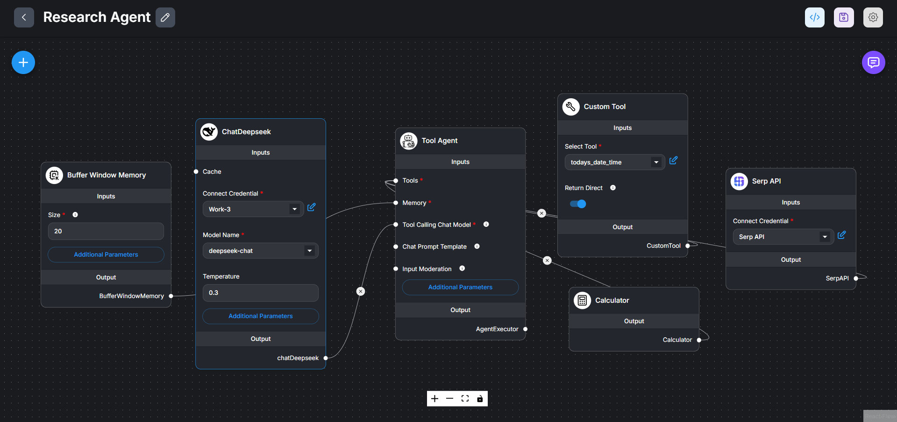

# Research Agent

A FlowiseAI research assistant workflow that helps users find answers quickly by searching the web, performing calculations, and retrieving up-to-date information. This agent provides accurate responses to various types of queries, from mathematical computations to factual questions.

## Workflow

Below is the visual representation of the Research Agent workflow:

## Examples

### Introduction and Math Tool Demonstration

The agent introduces itself as a research assistant and demonstrates its calculation capabilities:

### Using the Search Tool

The agent can retrieve information from the web to answer factual questions:

## How it Works

The Research Agent utilizes several components to provide comprehensive assistance:

1. **ChatDeepseek LLM**: Powers the conversational capabilities of the agent

2. **Buffer Window Memory**: Maintains conversation context to provide coherent responses

3. **Tool Agent (AgentExecutor)**: Coordinates the use of various tools based on the query type

4. **Integrated Tools**:
   - **Calculator**: Performs mathematical operations and calculations
   - **SerpAPI**: Retrieves up-to-date information from web searches
   - **Custom Tool**: Provides additional specialized functionality

The agent analyzes each query to determine the most appropriate tool to use, whether it's performing calculations, searching the web, or providing information from its knowledge base.

## Use Cases

- Getting answers to factual questions
- Performing complex mathematical calculations
- Retrieving current information about events, people, or topics
- Checking dates and times across different time zones
- Finding quick explanations for various concepts
